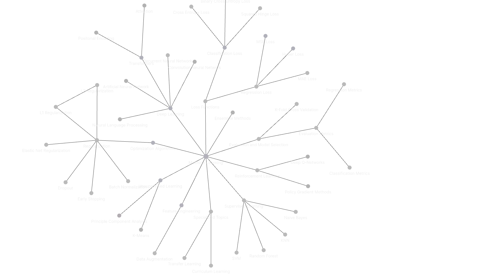

# Machine Learning Concepts

The aim of this repository is to store all machine learning concepts I have acquired from my experiences, courses, projects, etc ... 
Some parts are  shown through code (Mostly models) and some others are explained in text files.

I will be trying to keep a clear separation between all the concepts and update them regularly as I acquire more information.

**Note: Most explanations are very summarized, the goal here is to quickly refresh your mind when looking up a concept and emphasizing on the use cases, benefits and drawbacks.**

The **md** file structure is designed for seamless import into Obsidian.md

