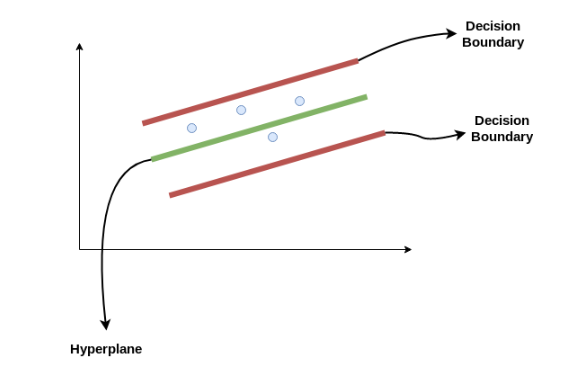

# Support Vector Machine

A support vector machine simply tries to find a separation between data points  in multidimensional space.
The separation could be linear or non-linear.

The main components of an SVM are:

* Kernel:  A kernel helps us find a hyperplane in the higher dimensional space without increasing the computational cost.
* Hyperplane: Separation between data points.
* Decision Boundary: All data points within decisions boundary are not clearly determined (They are very close to the hyperplane). This can be seen in the next figure.

 
 

 

We have two types of SVMs:

* SVR for regression, here are its main parameters:
  * Kernel represents the kernel type
  * C is a regularization parameter (The strength of the regularization is inversely proportional to C)
  * Epsilon in the epsilon-SVR model. It specifies the epsilon-tube within which no penalty is associated in the training loss function with points predicted within a distance epsilon from the actual value
* SVC for classification, here are its main parameters:
  * Kernel represents the kernel type
  * C is a regularization parameter (The strength of the regularization is inversely proportional to C)

Some of the most relevant SVM kernels:
* Polynomial kernel: Popular in Image processing
* Gaussian kernel: t is a general-purpose kernel; used when there is no prior knowledge about the data
* Gaussian radial basis function (RBF): Same use-case as the Gaussian kernel
* Laplace RBF kernel: Same use-case as the Gaussian kernel

Here is a simple SVR [code sample](../basic_machine_learning/svm.py)

## Reference(s)
[Support Vector Machines: Theory and Applications](https://www.researchgate.net/publication/221621494_Support_Vector_Machines_Theory_and_Applications)