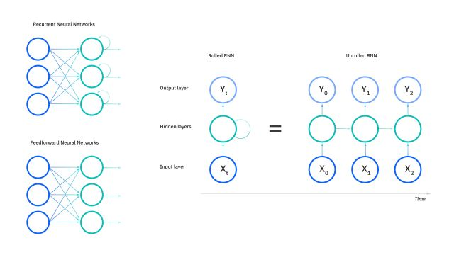

# Recurrent Neural Networks (RNN)

A recurrent neural network (RNN) is a type of neural network which uses sequential data or time series data. 

Use case examples:
- Language translation
- Natural language processing (NLP)
- Speech recognition
- Image captioning

They are distinguished by their “memory” as they take information from prior inputs
to influence the current input and output.
While traditional deep neural networks assume that inputs and outputs are independent of each other, the output of recurrent
neural networks depend on the prior elements within the sequence.

While future events would also be helpful in determining the output of
a given sequence, **unidirectional** recurrent neural networks cannot account for these events in their predictions.

## Reference(s)
[What is recurrent neural networks?](https://www.ibm.com/topics/recurrent-neural-networks)
