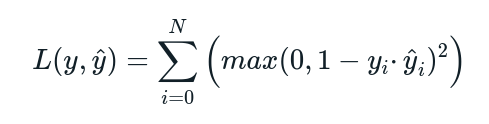

# Squared Hinge Loss
The squared hinge is used to draw an accurate decision boundary which penalizes large errors more significantly than smaller errors. (Usually used with SVMs)

Here is the loss function equation:

Output Layer Configuration: One node with a **tanh** activation unit. (Target values are in the set {-1, 1})

## Reference(s)
[Squared Hinge Loss](https://torchmetrics.readthedocs.io/en/stable/classification/hinge_loss.html)