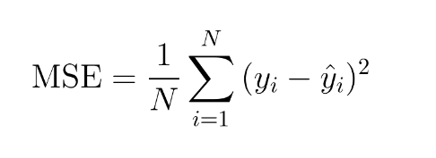

# Mean Squared Error Loss

It is one of the most common loss functions as it is extremely simple.

Here is the loss function equation:

It is simply the difference between the predicted and true values squared. The sum of differences is then
divided by the total number of data points.