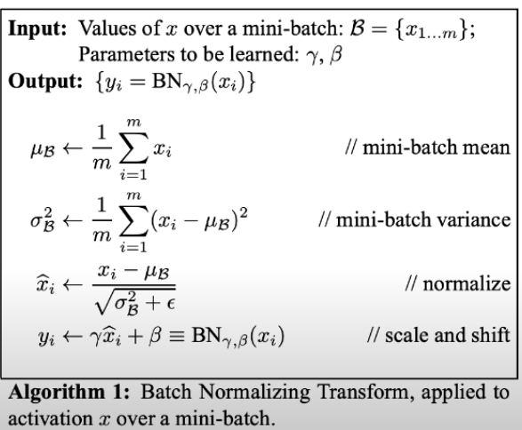

# Batch Normalization

In simple terms, batch normalization refers to normalizing the output data from the activation functions of a layer so that if one output is greatly larger than the others, it does not introduce 
instability in our model. Normalization happens on a per-batch basis.

As can be seen in the formulas, after normalizing, we have a scale and shift operation using gamma and beta,
these parameters are trainable and will be optimized during the training process.

**The main benefits of batch normalization are:**

* Faster training time
* Decreases the importance of initial weights
* Model regularization (Introduces randomness due to the mean and variance for every neuron activation which is highly dependent on the batch)

## Reference(s)
[Batch Normalization Orthogonalizes Representations in Deep Random Networks](https://arxiv.org/abs/2106.03970)