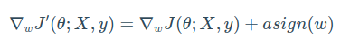

# L1  regularization

L1 regularization, also known as Lasso regularization, is a technique used in machine learning to prevent overfitting.
It adds a term to the loss function that penalizes the absolute value of the magnitude of the model's weights.
The regularization term is typically a multiple of the L1-norm of the weights vector, often denoted by lambda.

The effect of L1 regularization is to push the model's weights towards zero, which has the effect of shrinking the less important feature's coefficient to zero.

This can be useful for feature selection, as it tends to give sparse solutions, with many weights equal to zero. This can be contrasted with L2 regularization(Ridge regularization),
which adds a term to the loss function that penalizes the square of the magnitude of the model's weights, and encourages small weights, but not zero weights.

## Reference(s)
[L1 Regularization](https://theaisummer.com/regularization/)