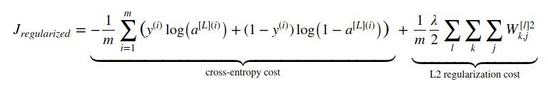

# L2 regularization

L2 regularization simply consists of adding a regularization value to our cost function.

As we can see in the L2 regularization cost, it penalizes high values in the model's weights making it less
prone to overfitting.

## Reference(s)
[L2 Regularization for Learning Kernels](https://arxiv.org/abs/1205.2653)