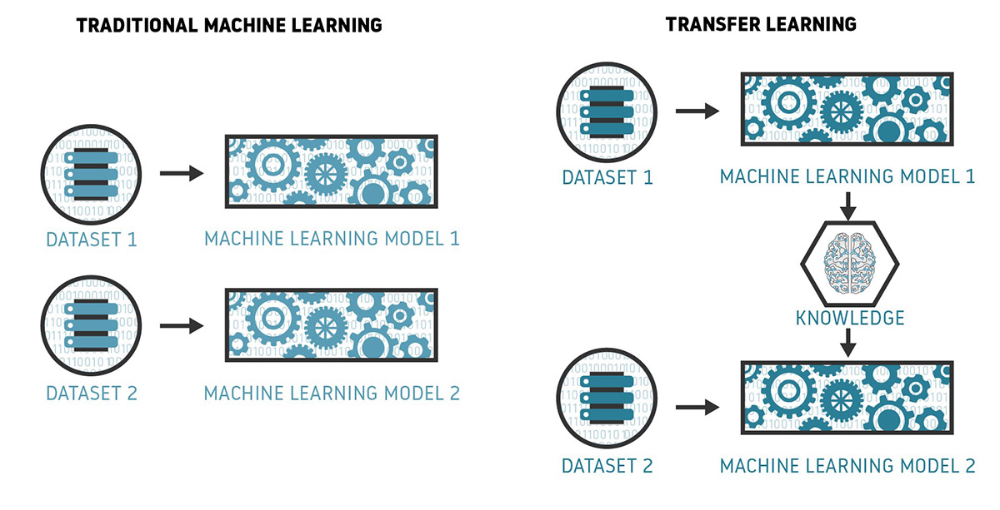

# Transfer Learning

Transfer learning is a technique used in machine learning where a
model trained to perform one task is used as the  starting point for a model trained to perform a related task.

## Reference(s)
[Transfer Learning](https://www.seldon.io/transfer-learning)